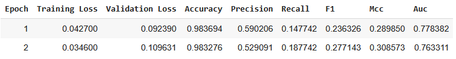
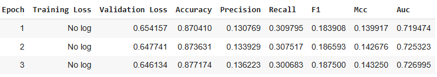
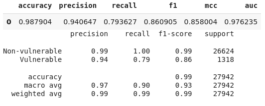
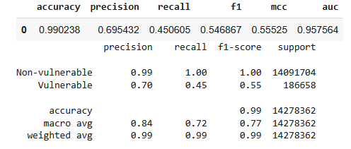
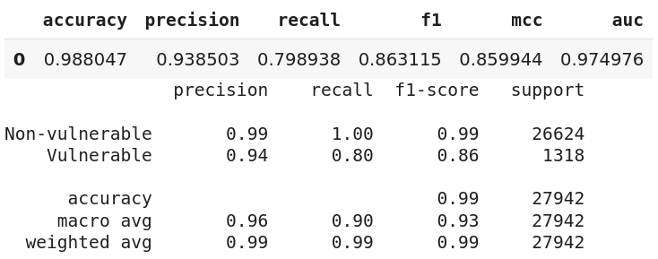
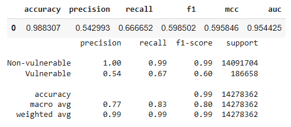

<!-- 
To create the pdf use pandoc:
pandoc --citeproc report.md -o report.pdf
-->

\thispagestyle{empty} <!-- no pagenumber on titlepage -->

\newpage

\tableofcontents

\newpage

# Introduction

For our submission, we have experimented with the big-vul dataset to achieve a generic classifier for detecting vulnerabilities in C++ on a per function and per line detection.
For the first milestone, we have relied on the pretrained CodeBert tokenizer to generate the vector embeddings.
Furthermore, we navigated through state of the art research approaches to facilitate our second milestone.
This resulted in attempting three different approaches for the second milestone: First, a native CodeBert binary classifier.
Second, a fine-tuned CodeBert model specifically for C++ code formulated the foundation for a binary sequence classifier.
Third, we attempted a bidirectional long short term memory (BILSTM) neural network approach where we relied only on the fine tuned Codebert to obtain the embeddings which were fed to the network.
Due to the severe requirements for resources on the BILSTM to achieve reasonable results, the third milestone built upon the second approach in the second milestone.
A separate token classification model is trained on the same dataset with resampling in the training dataset.
The token classification model is only triggered when the sequence classification highlights a function as vulnerable.
We also investigated a sliding window mechanism as well as the use of the Longformer model and both options were deprecated due to lack of significant results and resource constraints.

\newpage

# Milestone 1: Embedding Extraction

Thanks to the precleaned dataset, We did not have to do manual clean up on the dataset to remove comments and other non syntax related additions.
However, we deleted the unnecessary columns such as `bigvul_id` and initially `flaw_line_no` which was not necessary for the milestone.
Furthermore, splitting the dataset into training, testing and evaluation sets.
We used the huggingface trainer library for loading the tokenizer and the model.

# Milestone 2: Per Function Classification

For Milestone 2, we have developed three different approaches:

1. Basic CodeBert Binary Classification
2. FineTuned CodeBert for C++ Binary Classification
3. BILSTM Neural Network Binary Classification with FineTuned CodeBert embeddings

## Basic CodeBert Binary Classification

We use an already existing tokenizer to train a classifier to label a function as vulnerable or non-vulnerable.
We decided to use the base coderbert model by microsoft[^hf-cb-base] since it is well established as a simple and efficient baseline model.
Upon looking at other model we could use we found a codebert model fine-tuned on C++[^hf-cb-cpp] which led to marginal improvements so we decided to use it for milestone 3.

[^hf-cb-base]: [https://huggingface.co/microsoft/codebert-base](https://huggingface.co/microsoft/codebert-base)
[^hf-cb-cpp]:  [https://huggingface.co/neulab/codebert-cpp](https://huggingface.co/neulab/codebert-cpp)


## BILSTM Neural Network Binary Classification

This approach is based on the paper "VulD-CodeBERT: CodeBERT-based Vulnerability Detection Model for C/C++ Code 2024" which involves the use of two models with a soft voting mechanism.
The first model is a BILSTM model while the other is a multinomial binary classifier.
The combination of the two classification models aims to overcome two issues:

1. Imbalanced datasets which is the case in our Big-Vul dataset with 95% non vulnerable snippents.
2. The need for huge amounts of data to have a good classification model.
   While the BILSTM requires significant amounts of data, the MultiNominal classifier requires significantly less data which can assist with false positives, false negatives when the difference between the characteristics of vulnerable and non-vulnerable are not obvious.

We implemented the BILSTM model which takes two forms of input:

1. Code Fragment as a whole using the special CLS embeddings as Pooler Output from CodeBert
2. Word Fragments as sequence output which is then fed into the BILSTM with attention mechanisms
3. Code fragment and the output of the BILSTM are combined to form the classifier which finally results into the binary classification

The BILSTIM Approach however also had significant issues which caused us to abandon the idea for Milestone 3.

1. Significantly slower training time when compared to binary classifiers built on CodeBert.
   Ten percent of the data on T4 Colab session requires 1.5 hours to complete.
2. Suffers severely from data imbalance resulting in false positives and false negatives during training as observed on the confusion matrix.
3. Fine Tuning the metrics for training is extremely time consuming and requires various iterations of training.


# Milestone 3: Per Vulnerable Line Classification

## Abandoned Approaches

### Weighted Loss Mechanism

This approach relied on the basic mechanism of triggering the line detection model given that the function is vulnerable.
The key distinctions in this approach are the use of a weight loss function and a sliding Window for context.
The weighted loss function attempts to resolve the significant dataset imbalance by assigning a higher loss value to the minority category (Vulnerable), while the sliding window mechanism seeks to provide context between lines since a vulnerable line would likely be somehow connected to the previous or following lines.
In testing, the window would be defined as zero thus targeting each specific line.
However, due to resource constraints, the colab session never managed to fulfill a full training session with even ten percent of the dataset.



### Longformer

While looking for options to overcome the 512 token sequence length barrier of CodeBert, we came across Longformer.
Longformer is a transformer model for long documents.
`longformer-base-4096` is a BERT-like model started from the RoBERTa checkpoint and pretrained for MLM on long documents.
It supports sequences of length up to 4096.
Longformer uses a combination of a sliding window local attention and global attention.
Global attention is user-configured based on the task to allow the model to learn task-specific representations [@hf-longformer].
In theory, this model should spot cross-line patterns CodeBERT misses, so we started implementing this model in our baseline notebook to test this approach.
The first change made to implement this model was to enable global-attention mask helper, which was needed by this model with the following snippet on the notebook:

``` python
def _with_global_attention(enc):
    if isinstance(enc["input_ids"][0], list):
        enc["global_attention_mask"] = [
            [1]+[0]*(len(ids)-1) for ids in enc["input_ids"]]
    elif isinstance(enc["input_ids"], torch.Tensor):
        g = torch.zeros_like(enc["input_ids"])
        g[..., 0] = 1
        enc["global_attention_mask"] = g
    else:
        enc["global_attention_mask"] = [1]+[0]*(len(enc["input_ids"])-1)
    return enc

def tokenize(batch):
    max_len = tokenizer_max_length if not use_tokenizer_max_length
        else tokenizer.model_max_length
    enc = tokenizer(batch["code"],
        padding="max_length", truncation=True, max_length=max_len)
    return _with_global_attention(enc)
```

We then ran this notebook with the following parameters:

``` python
epochs = 3

tokenizer_name        = "allenai/longformer-base-4096"
fn_level_model_name   = "allenai/longformer-base-4096"
line_level_model_name = "allenai/longformer-base-4096"

use_tokenizer_max_length = True

fn_level_trainer_args = TrainingArguments(
    per_device_train_batch_size = 150,
    per_device_eval_batch_size  = 150,
    gradient_accumulation_steps = 4,
    # other config ommited for brevity
)

line_level_trainer_args = TrainingArguments(
    per_device_train_batch_size = 150,
    per_device_eval_batch_size  = 150,
    gradient_accumulation_steps = 4,
    # other config ommited for brevity
)
```

According to Colab, training the model would take an estimated 20 hours, which was not viable given our constraints. Therefore, we started tweaking the approach and hyperparameters to make the model more lightweight for our conditions.
Due to time constraints and the cooldown period of Google Colab, whereby free resources are available once every 24 hours, we also purchased some computing units from the paid services of Google Colab.
After checking the cost of training with an A100 GPU on Colab, we found that running the baseline Longformer model would consume about seven compute units per hour, so we had to limit the amount of time we would run this baseline Longformer approach.

To reduce the execution time and save on the computing units, here are the approaches we followed:

1. Gradient checkpointing
2. Used bf16 precision instead of fp16
3. Used LoRA adapters and froze the backbone
4. Used 2048 token length and trained on 50% of the full dataset

The result of these adjustments can be seen in Figure \ref{lf-res-after}.

 

After consultation and comparison to the other approaches we could run using the free tier of Google Colab, we decided to stop pursuing this approach as it would be too computationally expensive for our course budget while providing little or no metric gain on Big-Vul.
Even though the model we used was heavily redacted and pruned as we froze most of the layers, the metrics received would not justify the cost to use Longformer for our use case.

## Baseline CodeBert

This approach represents a basic two model setup with the unmodified dataset (See Figures \ref{baseline-fn} and \ref{baseline-line}). 





- The accuracy is inflated given that the imbalanced dataset has almost every line as non vulnerable.
  Therefore, this is a weak indicative and should not be considered accurate.
- Precision in cause of Vulnerable lines is 70% which is a decent value in flagging vulnerability.
- Recall is not optimal at 45%, basically the model is able to highlight the rough spot of the vulnerability but not the exact line.
  Furthermore, it also influences negatively the F1 value
- MCC does not achieve the optimal 70% threshold.
  However, at 55% the model is considered effective at detecting vulnerabilities.
- AUC at 95% highlights great separation capabilities and it also suggests that given the other measures, solving the problem of line-vulnerability could potentially be more than a basic binary classification approach and should incorporate other mechanisms.


## Balancing the dataset

Balancing the dataset by reducing the non-vulnerable functions by 50 percent and then oversampling the vulnerable ones until the ratio of vulnerable to non-vulnerable functions is one to one resulted in significantly improved results.





\newpage

# References

- Source code: [github.com/Meerschwein/Automating-SE](https://github.com/Meerschwein/Automating-SE)
- Trained models: [aauklagenfurt-my.sharepoint.com](https://aauklagenfurt-my.sharepoint.com/personal/merlinvo_edu_aau_at/_layouts/15/onedrive.aspx?id=%2Fpersonal%2Fmerlinvo%5Fedu%5Faau%5Fat%2FDocuments%2Fai&ga=1)
- Final Slides: [docs.google.com/presentation](https://docs.google.com/presentation/d/1CQoZ86lJr3JKXkIUoRfV7mNCRdJGWx5OSxvF8yuJ_mQ/edit?usp=sharing)

::: {#refs}
:::
